# c-gui

A *minimal* cross-platform **C** rapid `GUI` *Application Builder*.

The major dependency needed is what the O.S provides natively.
For *aesthetic* reasons **Linux** will require some additional libraries `OpenGL` besides `X11`.

## Linux

This started out first on **Linux** with no prior understanding of X11 programming inferface, mainly inspired by following the pattern layout in [Minimal cross-platform graphics](https://zserge.com/posts/fenster). Digging more into *X11 universe*, the aesthetics part seemed to be a big after thought. Plenty of info on **X11 API**, but no official code tutorials. The closet that has actually example code is [X-windows: programming with Athena widgets](https://ergodic.ugr.es/cphys_pedro/unix/intro.html).

* Began with a simplier menu layout derived from [X11 Menus (how to)](https://www.linuxquestions.org/questions/programming-9/x11-menus-how-to-839904/), the source for `OpenGL` dependency.
* Switched to an alterative [Athena Widgets/Xaw implementations](https://forums.freebsd.org/threads/athena-widgets-xaw-implementations.81588/) toolkit, parts of this *library* includes various aspects of [Survey of Widget Sets](http://www.efalk.org/Widgets/).
* To my discovery there is a project [Mowitz](https://github.com/UlricE/Mowitz) that has all basic **GUI** *aesthetic* features for Linux covered. This includes a native [WebView](https://en.wikipedia.org/wiki/WebView) widget implementation. It's [Kylie](https://siag.nu/kylie/), *very buggy, leaks, only **http**,* but is a starting point for **NO GTK** needed, **PR's are welcome**. More work is required to bring it up to standards. Currently, the **kylie** *application* has been striped back down to a *reusable* widget only.
* This project embeds a modified version of the [webview-c](https://github.com/javalikescript/webview-c), the examples has been tested working as expected on **Windows** and **macOS** only.

## Windows

After getting a basic functional **Linux** startup running under `WSL2`. The same **skeleton app** needed major refactoring for **Windows**, API changed to be simplier and more.

* I followed the [theForger's Win32 API Programming Tutorial](https://winprog.org/tutorial/).
* And [Windows API tutorial](https://zetcode.com/gui/winapi/).
* [WebView2](https://learn.microsoft.com/en-us/microsoft-edge/webview2/) is now supported and included by default.

## Apple macOS

**Apple macOS** required the most reading, and a lot of trial and error, going from *objective-c* to *c* and *back*. There is one question to ask [Can you build a foundation with a spoon?](http://stackoverflow.com/questions/10289890/how-to-write-ios-app-purely-in-c#comment13239523_10289913).

* [Minimalist Cocoa programming](https://www.cocoawithlove.com/2010/09/minimalist-cocoa-programming.html)
* [Cocoa in Pure C](https://github.com/ColleagueRiley/Cocoa-in-Pure-C)
* [The Objective-C Programming Language](https://developer.apple.com/library/archive/documentation/Cocoa/Conceptual/ObjectiveC/Chapters/ocObjectsClasses.html)
* [Cocoa Programming/Objective-C basics](https://en.wikibooks.org/wiki/Cocoa_Programming/Objective-C_basics)
* [Understanding the Objective-C Runtime](https://cocoasamurai.blogspot.com/2010/01/understanding-objective-c-runtime.html)
* [Design of a multi-platform app](https://www.cocoawithlove.com/2010/04/design-of-multi-platform-app-using.html)
* [Creating Classes at Runtime in Objective-C](https://www.mikeash.com/pyblog/friday-qa-2010-11-6-creating-classes-at-runtime-in-objective-c.html)

The same **skeleton app** overhauled to include most **Apple macOS API** automatic logic handling, which are shortcuts to various aspects of [Cocoa examples without StoryBoard](https://github.com/gammasoft71/Examples_Cocoa) and [Cocoa macOS Examples [Objective-C]](https://github.com/NikolaGrujic91/Cocoa-macOS-Examples). Cocoa [AppKit](https://developer.apple.com/documentation/appkit/) controls without StoryBoard only by programming code (objective-c).

> NOTE: The **Linux** and **Windows** API will always need refactoring to match **Apple** behavior. The **skeleton app** *should have no platform specific code*. **Linux** will be the most challenging part without resorting to **GTK**, **Qt**. I have *no direct* plans to add, **PR** are welcome.
> This should be must *lighter* and *easier* to follow than something like [Cross-Platform C SDK - NAppGUI](https://github.com/frang75/nappgui_src).

## Installation

[CMake](https://cmake.org) `FetchContent` and `find_package` is use here to setup your project `App`. Your **WILL** need to *modify* every *file* in [resources](./resources/) folder. The folder will be created in your *root directory* if it doesn't exist. This project started out inside **repo** [Httpi](https://github.com/zelang-dev/httpi), all prior commits are there. This is provided as *quick way* to *reproduce* an *GUI* `App` with little effort. It will be *updated as needed*, unless **PR** provided.

```sh
find_package(gui QUIET CONFIG)
if(NOT gui_FOUND)
 FetchContent_Declare(gui
  URL https://github.com/zelang-dev/c-gui/archive/refs/heads/main.zip
  #URL https://github.com/zelang-dev/c-gui/archive/refs/tags/v0.0.1.zip
  #URL_MD5 6e9756dee0ef5903d850dc021d5df725
 )
 FetchContent_MakeAvailable(gui)
endif()
target_include_directories(your_project
 PRIVATE $<BUILD_INTERFACE:${GUI_INCLUDE_DIR} $<INSTALL_INTERFACE:${GUI_INCLUDE_DIR})
target_link_libraries(your_project PUBLIC GUI::MINI)
```

### Usage

```c
#include <gui.h>

#define IDC_FIELD1 10
#define IDC_FIELD2  20
#define IDC_FIELD3 30
#define IDC_FIELD4 40

void form_prompt(__GUI_MENU__) {
 gui_info ui = {0};
 ui_field form[] = {
   {IDC_FIELD1, field_text, "Name", "Free alternative to the Motif XmTextField", 290, 40, 1},
   {IDC_FIELD2, field_secret, "Password", "Fixed Length", 130, 0, 8},
   {IDC_FIELD3, field_text, NULL, "No Echo", 90, 6, 4},
   {IDC_FIELD4, field_text, NULL, "No Pending Delete", 160, 16, 10},
 };

 gui_form(&ui, "Form Fill", form, 4, (ui_form_cb)data);
 gui_active(ui);
 gui_destroy(ui);
}

void message_box(__GUI_MENU__) {
 ui_button buttons = {0};
 char lang_bt_eng[] = "English";

 buttons[0].label = lang_bt_eng;
 int res = gui_message_box(self, "Language",
  "Please choose a language.", buttons, 1);
 printf("messageBox return %d\n", res);

 if (res == 1) {
  buttons[0].label = "No";
  buttons[1].label = "Yes";
  buttons[2].label = "Maybe";
  res = gui_message_box(self, "Answer this question",
   "Do you like to program in C language?", buttons, 3);
  printf("messageBox return %d\n", res);
  if (res == 1) {
   buttons[0].label = "Accept";
   res = gui_message_box(self, "Oops",
 "Unfortunately, you are a bad person.\nThere is nothing I can do for you.", buttons, 1);
   printf("messageBox return %d\n", res);
  }
 }
}

void web_box(__GUI_MENU__) {
 gui_info ui = {0};
 gui_webview(&ui, "Webview", "http://www.faqs.org", 800, 300, true);
 gui_webactive(ui);
 gui_webdestroy(ui);
}

#define ID_FILE_OPEN 1
#define ID_FILE_FORM  2
#define ID_MODE_ALERT 3
#define ID_MODE_ARCADE 4
#define ID_MODE_KEY  5
#define ID_FILE_SAVE  6
#define ID_WEB_BOX  7

int main(int argc, char **argv) {
 int error = -1;
 gui_info ui = {0};
 if (gui_window(&ui, "Skeleton", 600, 600, false)
  && gui_menubar(&ui, 2)) {
  menuitem_t items[] = {
   {ID_FILE_OPEN, "Open", gui_open_dialog, "O", NULL},
   {ID_FILE_SAVE, "Save", gui_save_dialog, "S", NULL},
   {__GUI_SEPERATOR__},
   {ID_FILE_FORM, "Form", form_prompt, "F", NULL},
  };

  menuitem_t items_two[] = {
   {ID_MODE_ALERT, "Alert Box", message_box, "A", NULL},
   {ID_MODE_ARCADE, "Arcade Box", color_box, "B", NULL},
   {ID_MODE_KEY, "Key Box", key_box, "K", NULL},
   {__GUI_SEPERATOR__},
   {ID_WEB_BOX, "Webview Box", web_box, "W", NULL},
  };

  if (!gui_menufont(&ui, lucida)
   || !gui_menu(&ui, 0, items, 4, 1, "File")
   || !gui_menu(&ui, 1, items_two, 5, 2, "Mode")) {
   error = -2;
  }

  // All other logic before entering event loop.

  if (error == -1)
   error = gui_handler(&ui);

  gui_close(&ui);
 }

 return error;
}
```

## Screenshots

<table>
<tr>
<th>Apple macOS</th>
<th>Windows</th>
<th>Linux X11 - WSL2</th>
</tr>
<tr>
<td>
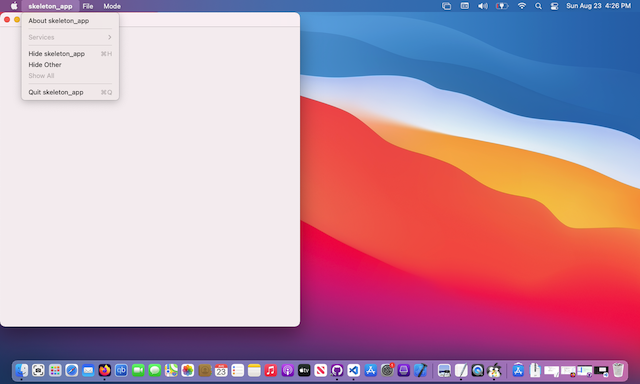
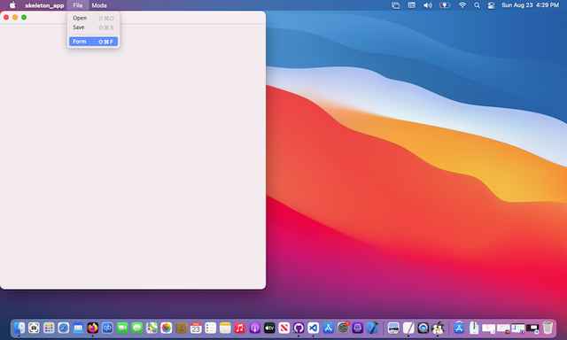
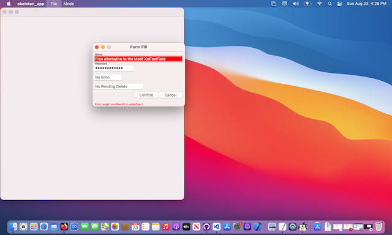
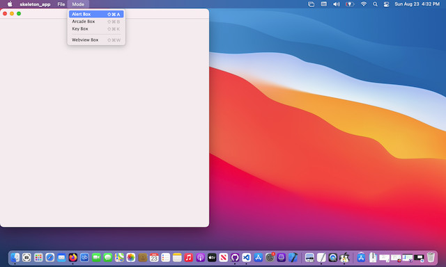
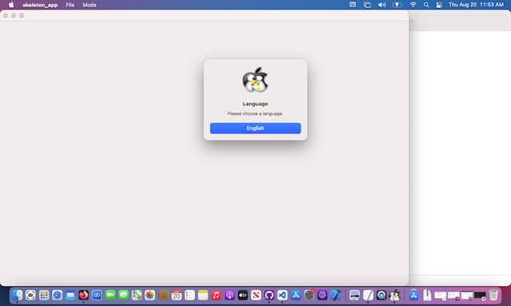
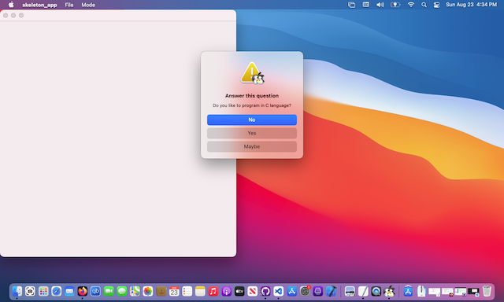
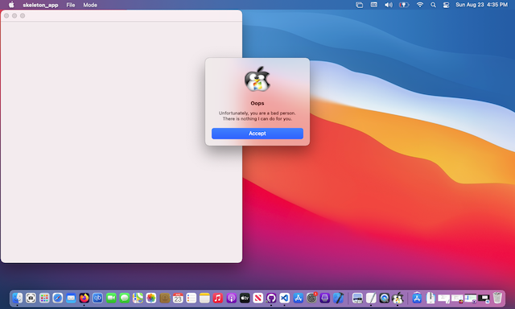
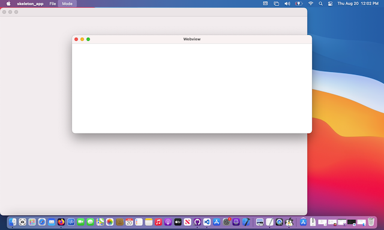
</td>
<td>
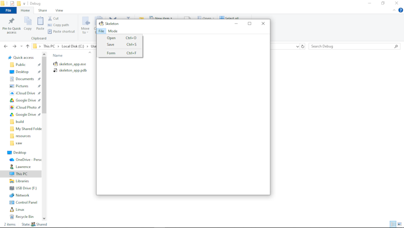
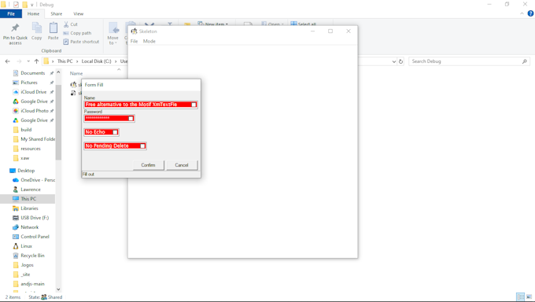
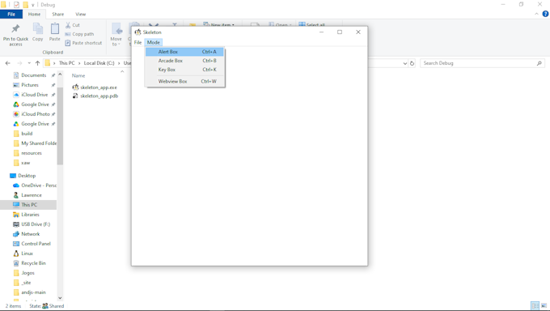
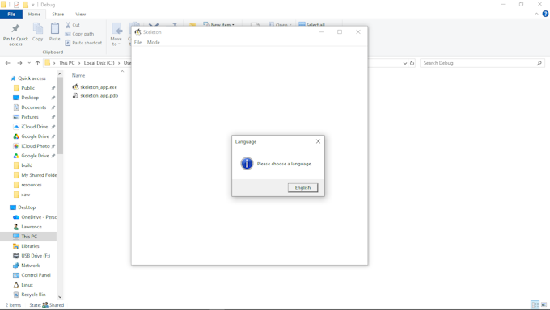
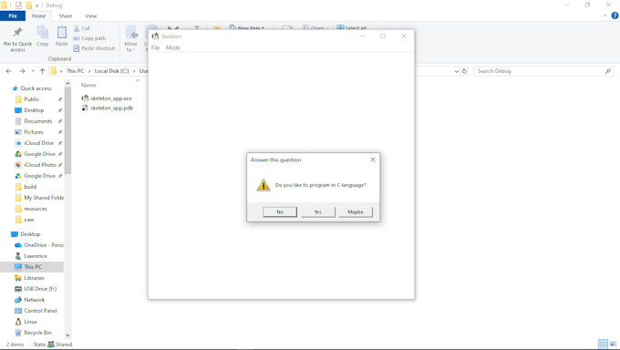
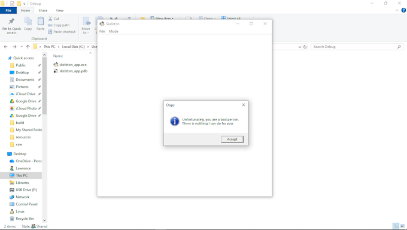
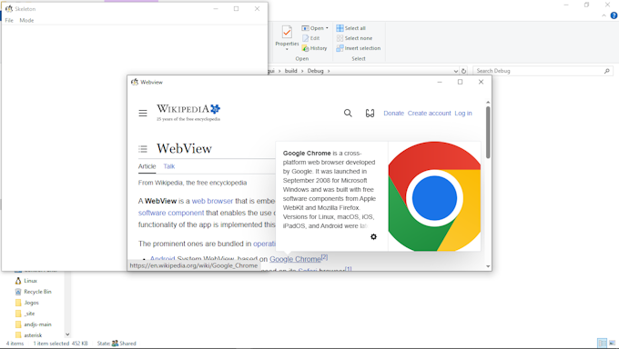
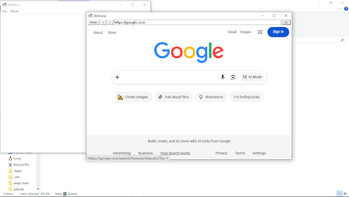
</td>
<td>
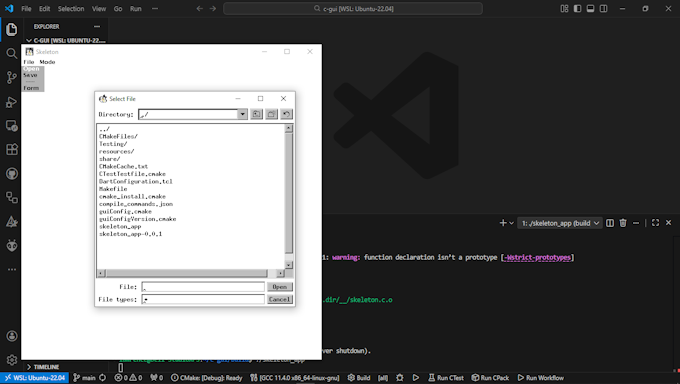
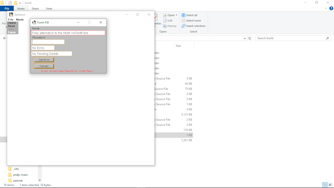
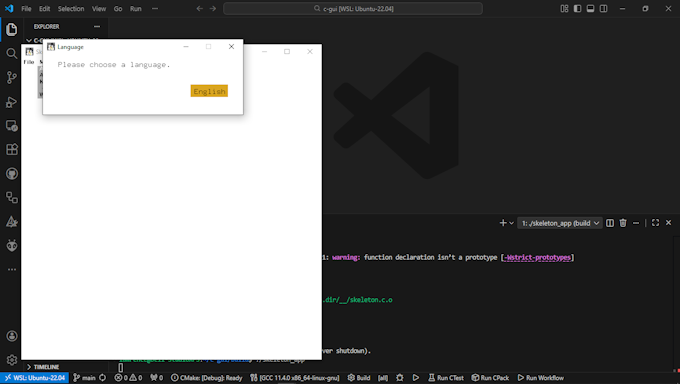
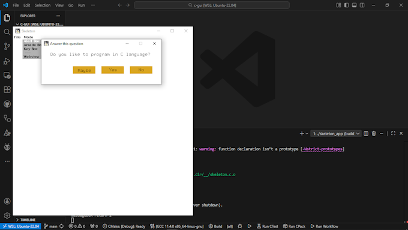
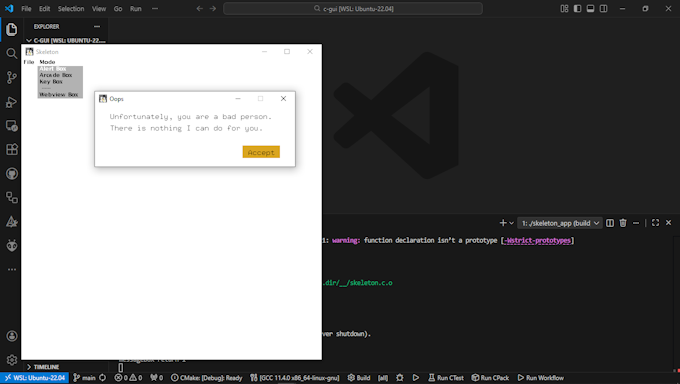
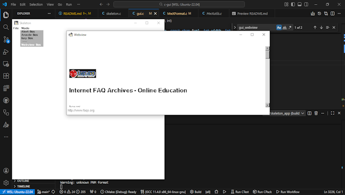
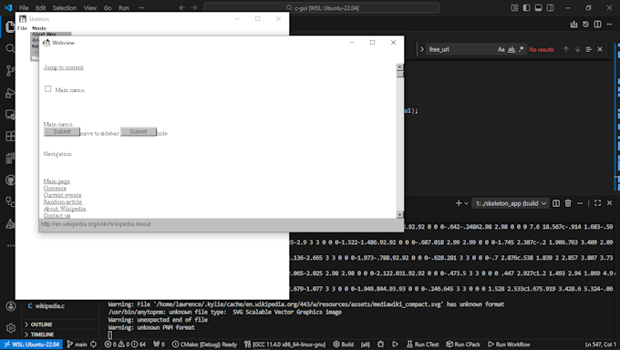
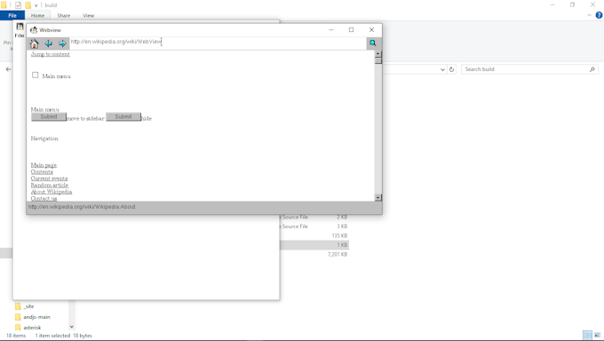
</td>
</tr>
</table>

## Contributing

Contributions are encouraged and welcome; I am always happy to get feedback or pull requests on Github :) Create [Github Issues](https://github.com/zelang-dev/c-events/issues) for bugs and new features and comment on the ones you are interested in.

## License

The MIT License (MIT). Please see [License File](LICENSE.md) for more information.
